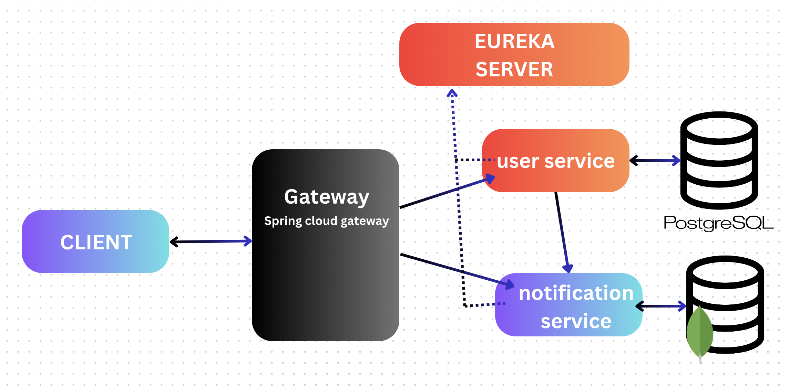

# Spring Cloud Gateway Microservices

The goal of this project is to implement an API gateway in a microservices project. This repository serves as a basic
example of a gateway with YAML file configurations.

## Features

### 1. API Gateway

- Implements a gateway for routing requests to various microservices.
- Configurable via YAML files for flexible routing and filtering.

### 2. Eureka Discovery Server

- Centralized service registry for dynamic service registration and discovery.
- Enables load balancing and fault tolerance.

### 3. Spring Cloud Config

- Centralized configuration management for microservices.
- Allows dynamic configuration updates.

### 4. User Service

- Manages user-related operations.
- Supports user creation, retrieval, and storage in a PostgreSQL database.
- Communicates with other services through the gateway.

### 5. Notification Service

- Handles notifications for users.
- Stores notification data in a MongoDB collection.
- Provides APIs for saving and retrieving notifications.

### 6. Inter-Service Communication

- Utilizes Spring Cloud OpenFeign for declarative REST client communication.
- Supports service discovery and load balancing through Eureka.

### 7. Database Configuration

- **User Service**: Uses PostgreSQL with Hibernate for ORM.
- **Notification Service**: Uses MongoDB with Spring Data MongoDB for NoSQL database operations.

## Technologies Used

- **Spring Boot** for building microservices.
- **Spring Cloud** for service discovery, configuration, and Feign integration.
- **MongoDB** and **PostgreSQL** as databases.
- **Docker** for containerization.

## Getting Started

To get started with this project, clone the repository and follow the instructions in the respective service directories
to set up and run the services.
